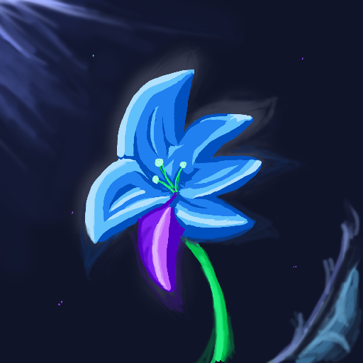

# Stardust Orchid

<a class="ct_button" href="https://ceterai.github.io/Workshop/OGXMods/StardustOrchid">WEBSITE</a> | <a class="ct_button" href="https://store.gx.me/mods/xxicvm/stardust-orchid/">OPERA GX STORE</a> | <a class="ct_button" href="https://github.com/Ceterai/StardustOrchid-OGXM">GITHUB</a> | <a class="ct_button" href="https://buymeacoffee.com/ceterai">DONATE</a> | <a class="ct_button" href="https://discord.gg/gGEwZ5vbgr">DISCORD</a>

An Opera GX mod depicting a rare stardust orchid.

## Installation

Click the **Install** button on the [Opera GX Mods page](https://store.gx.me/mods/xxicvm/stardust-orchid/) of this mod.

## Credits

Original Artwork:

- Dark Wallpaper & Icons: [**Stardust Moonbeam** | DeviantArt](https://www.deviantart.com/ceterai/art/Stardust-Moonbeam-960010662)
- Light Wallpaper: [**Stardust Daydream** | DeviantArt](https://www.deviantart.com/ceterai/art/Stardust-Daydream-960010657)

The mod is inspired by a Starbound mod I made called  **[My Enternia](https://ceterai.github.io/MyEnternia/)**.

## Showcase

---

  

